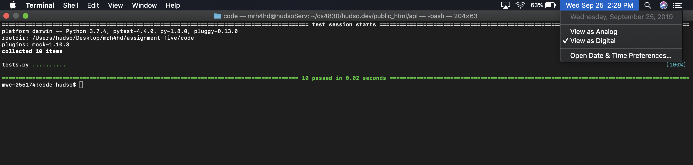
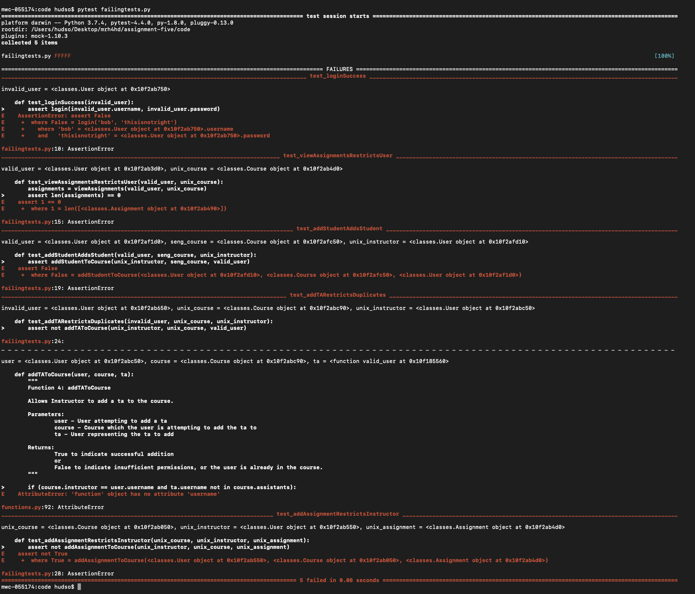

# Matt Hudson - Software Engineering I Fall '19 - Assignment 5: Testing Focus

My five functions were:

	1) Login
	2) View Assignments
	3) Add Student
	4) Add TA
	5) Add Assignment

I have the functions in [functions.py](./functions.py).

I defined classes to represent the data in [classes.py](./classes.py).

My test functions are defined in [tests.py](./tests.py) using fixtures defined in [fixtures.py](./fixtures.py).
Here is the CLI output showing the **passed** tests:

I wrote two tests for each function to check for different input cases.

For the failing tests, I gave 5 of the test functions the wrong input in [failingtests.py](./failingtests.py) (i.e. passed them the wrong fixtures), so I expected them to fail for assignment requirement #4.
Here is the CLI output showing the **failed** tests:

