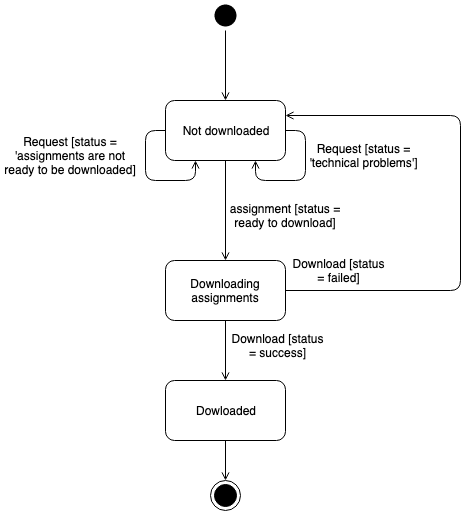

# CS 4320 - Software Engineering I - Fall 2019

## Assignment 4 - Design Focus: Architecture and System Design Process

Group 13

	- Weiyu Feng
	- Samuel Frimpong Jr.
	- Matt Hudson

## Table of Contents

	1) Use Case Diagram/Description: File Uploading
	2) Activity Diagram 1: Adding and Removing TAs
	3) Activity Diagram 2: Assignment Creation and Editing
	4) Activity Diagram 3: Searching for Students
	5) Class Diagram: Reading Assignment Instructions
	6) Entity Relationship Diagram
	7) Sequence Diagram: User Login/Logout
	8) State Machine Diagram: Assignment Collection
	9) Appendix: Summary of Contributions

## **1. Use Case Diagram/Description: File Uploading**

A *use case diagram and description* to represent uploading files:

> Student can submit/re-submit uploaded file
>relevant data: course data, assignment data, submission data
> constraints: Students can only choose the assignment from the classes that they enrolled. Students can only submit assignments that are open.

**Creator: Weiyu Fang**

Reviewers: Samuel Frimpong Jr., Matt Hudson

 
### **UserCaseDescription**

Use Case: Upload files over the web

Description: This use case allow students to choose files and upload files into the system over web, so that TA and instructors can view and grade students' assignments.
The user role is student. To meet assignment requirements, students have to choose files with certain allowed file types. System allows only correct file types for uploading. 
If selected files do not match the required file types, an error message will show up. If students encounter any technical problems while uploading files, they are able to 
contact tech support department for help.

Trigger: Students click the 'choose files' button

Primary Actor: Students

Secondary Actor: Tech department

Preconditions:

	- Students have to have a valid account and login
	- Students have to have access to assignments

Success guarantee:

	- selected files uploaded successfully into the system

Main success scenario:

1. Students click the button 'choose files' and choose files from their local machines
2. Students click 'upload' button and upload files into the system.

Failed end condition:
	- Selected files' types do not meet assignment's requirement
	- Technical problems

Extensions:

	1a. Students want to choose a file whose file type is not supported by system
		- System displays an error log and inform users correct file types
	1b. Students want to choose a file whose file type do not meet assignment requirements
		- System displays an error log and inform users correct file types
	2a. Students meet technical problems when uploading
		- Students can contact tech support department for help

## **2. Activity Diagrams**

### 2a. Activity Diagram 1: Adding and Removing TAs

An *activity diagram* to represent adding and removing TAs:

> Instructor can add /remove TAs for the course sections
> relevant data: TA data, course data
> constraints: Instructors can only add or remove TAs from their own course sections.

**Creator: Weiyu Feng**

Reviewers: Samuel Frimpong Jr., Matt Hudson

### 2b. Activity Diagram 2: Assignment Creation and Editing

An *activity diagram* to represent the creation and editing of assignments:

> Instructor can create/edit/remove courses and sections
> relevant data: student data, course data (including start and end dates), section data
> constraints: Instructors can only manage courses they have created, but cannot remove or access the other instructors' courses.

**Creator: Samuel Frimpong Jr.**

Reviewers: Weiyu Feng, Matt Hudson

### 2c. Activity Diagram 3: Searching for Students

An activity diagram to represent TAs/Instructor searching for a student in a course:

> TA can search students in a course
> relevant data: student data, course data
> constraints: TAs can search only the students who are in the course sections that they are assigned to manage.

**Creator: Matt Hudson**

Reviewers: Weiyu Fang, Samuel Frimpong Jr.

## **3. Class Diagram: Reading Assignment Instructions**

A Class Diagram to represent students reading assignment instructions:
> 2.	Student is able to read assignment instructions
> •	relevant data: assignment data
> •	constraints: Students can only access assignments of the courses that they are enrolled in.

**Creator: Matt Hudson**

Reviewers: Weiyu Fang, Samuel Frimpong Jr.

## **4. Entity-Relationship Diagram**

An Entity-Relationship Diagram to represent the entire system.

**Creator: Samuel Frimpong Jr.**

Reviewers: Weiyu Fang, __Matt Hudson__

## **5. Sequence Diagram: User Login/Logout**

A sequence diagram to represent users logging in and out of the system:

> Login/Logout
> relevant data: credential data (username & password)
> constraints: Students can use the system and access their courses and only their courses when they input correct username and matched password.

**Creators: Samuel Frimpong Jr., Matt Hudson**

Reviewer: Weiyu Fang

## **6. State Machine Diagram: Assignment Collection**

A state machine diagram to represent the collection of assignments:

> 5.	TA can collect assignments by downloading students' submission files
> •	relevant data: course data, assignment data, submission data
> •	constraints: The system will show only the assignments from the course sections for which they are listed as a TA.

**Creators: Weiyu Feng, Samuel Frimpong Jr.**

Reviewer: Matt Hudson

## Appendix: Summary of Contributions

Weiyu Fang: Use Case Diagram/Description, **Activity Diagram 2a**, State Machine Diagram

Samuel Frimpong Jr.: **Activity Diagram 2b**, Entity Relationship Diagram, Sequence Diagram, State Machine Diagram

Matt Hudson: Activity Diagram 2b (revising), **Activity Diagram 2c**, Class Diagram, Sequence Diagram, Document Formatting (pdf/markdown)

All members reviewed each other’s work before finalizing this document.
