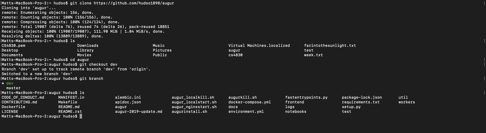
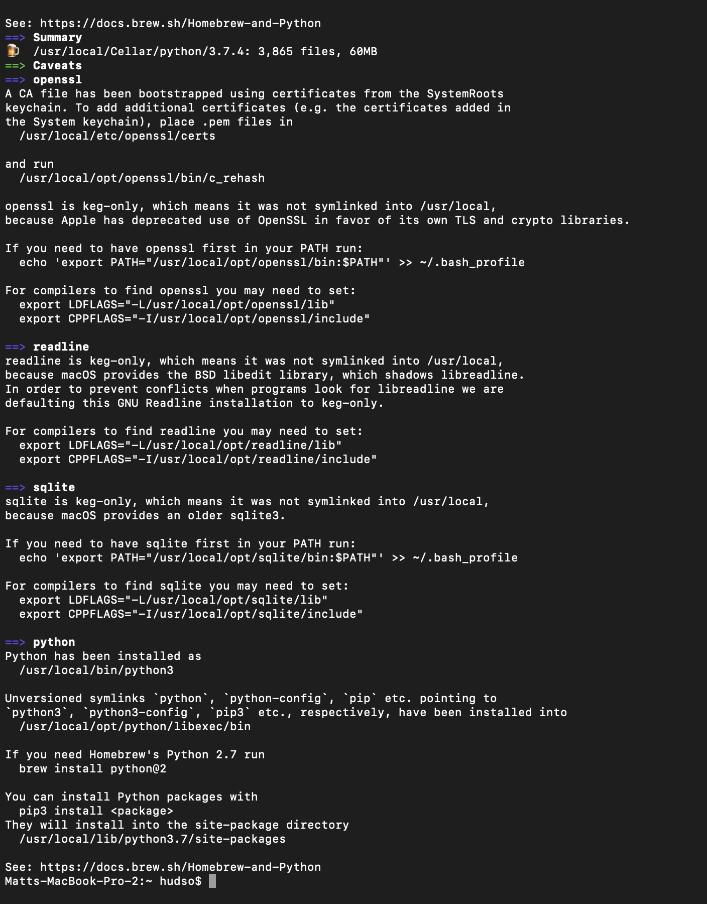
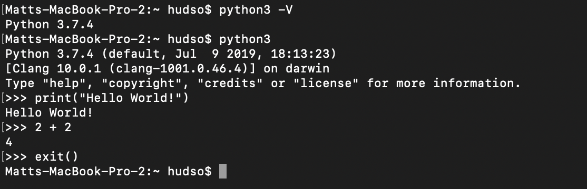
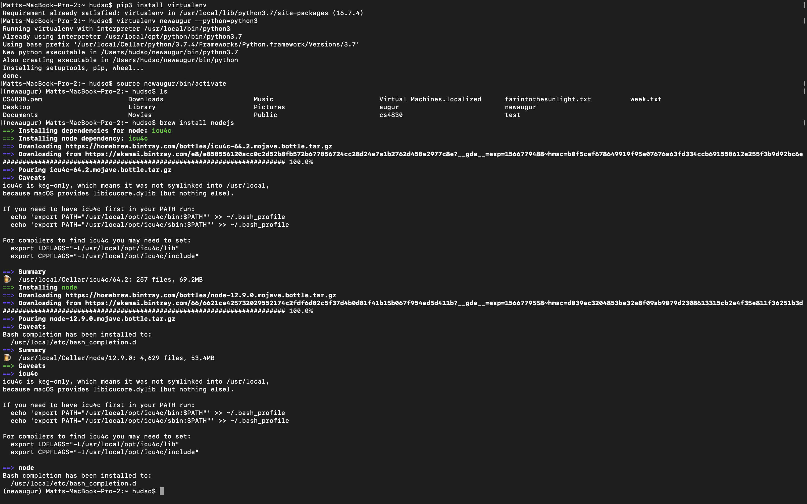

# CS4320 Assignment 1
### Matt Hudson - mrh4hd@mail.missouri.edu

My GitHub account: https://github.com/hudso1898

My GitHub submission repository (mrh4hd): https://github.com/hudso1898/mrh4hd

My fork of augur: https://github.com/hudso1898/augur

These screenshots demonstrate the meeting of assignment requirements as follows:

Clone of augur on my local machine + switching to dev branch: 

Installing python: 
(I did this on Mac using brew)

Python3 version 3.7.4 + verifying the REPL works: 

Using pip3 to install virtualenv, creating virtualenv for augur, starting the virtualenv, and installing nodejs: 

Commiting screenshots to mrh4hd repo: these commits! (I pushed from my Mac and did some edits on GitHub)
