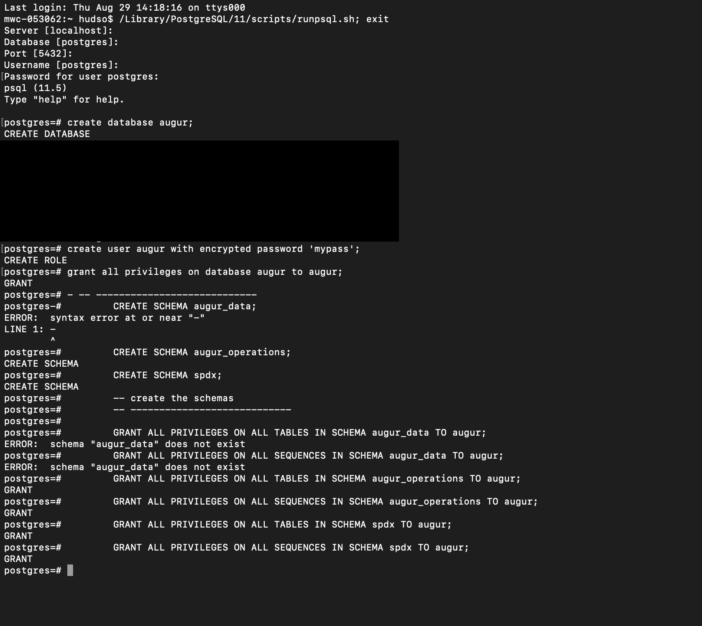
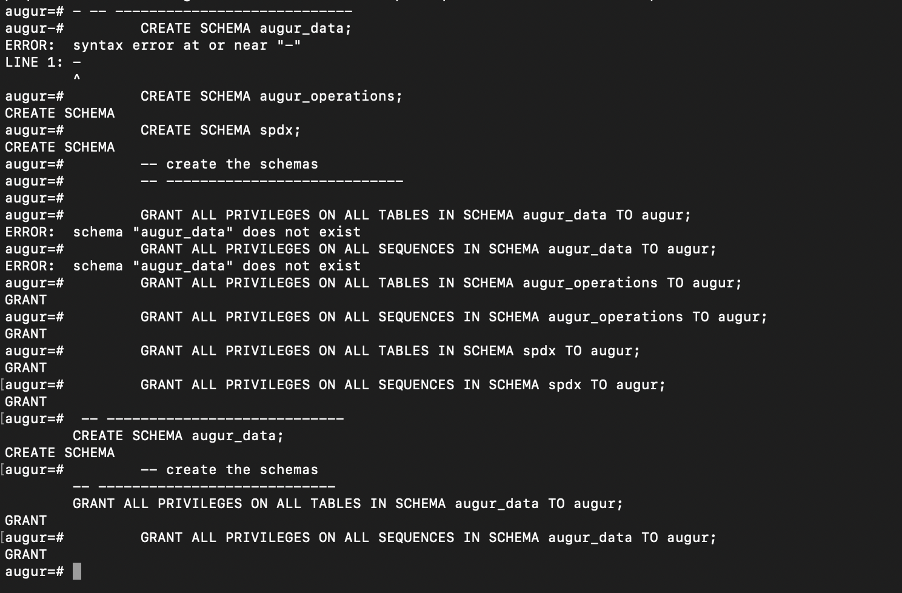
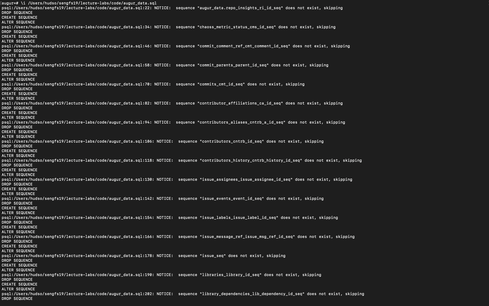
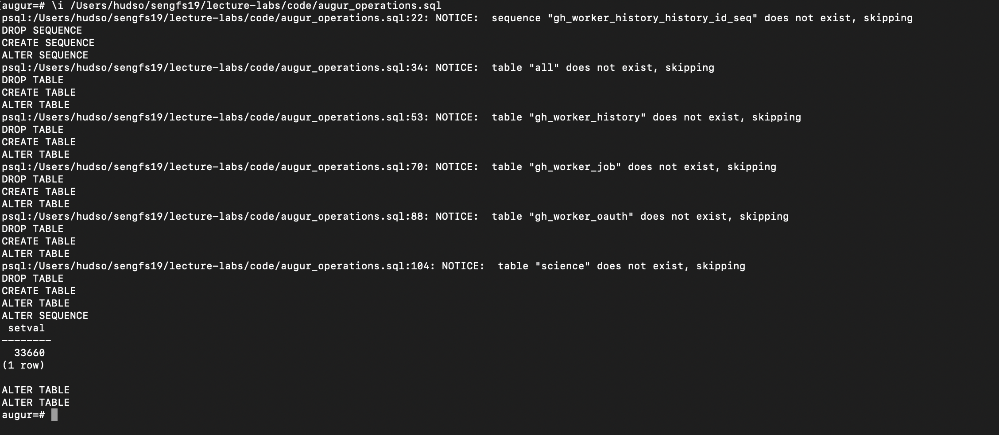
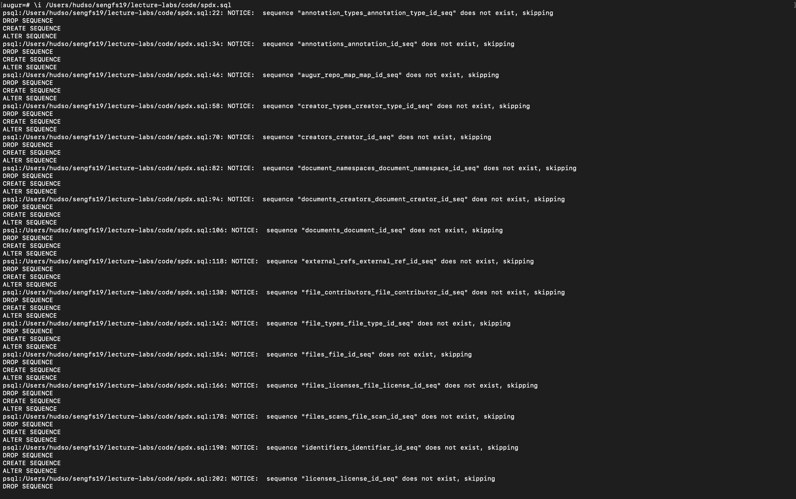
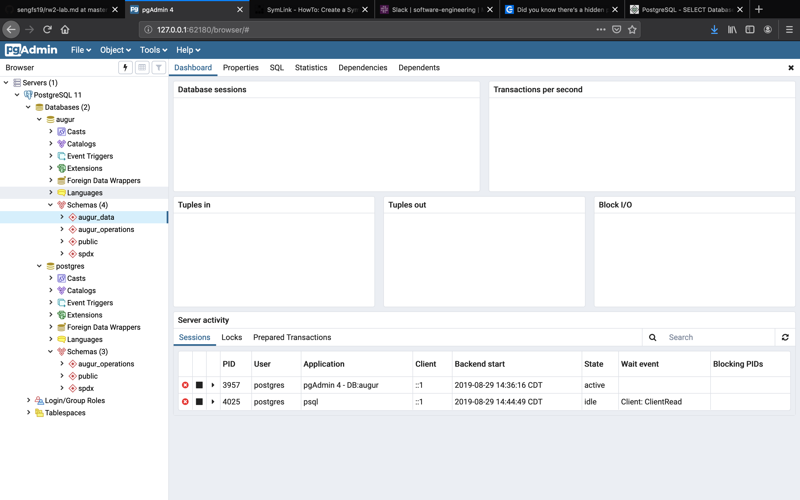
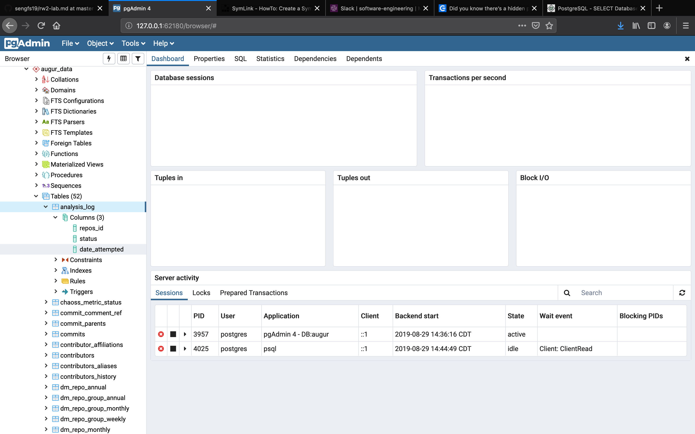

# Matt Hudson
## CS4830 - Software Engineering I - Fall '19

Thursday August 29th Lab

**see ethics.md in tw2 for that part of the lab**

To run postgres on the command line:

$ ln /Library/PostgreSQL/11/scripts/runpsql.sh psql

Then, I can use ./psql to run that script and use postgres from the command line.

(I had to select the augur database to run these correctly)

Setting up postgres: 

Setting up privileges: 

Running the SQL for augur_data: 

Running the SQL for augur_operations: 

Running the SQL for spdx: 

Seeing the right sequences in the web tool (pgAdmin): 

Seeing the schemas set up in pgAdmin: 
