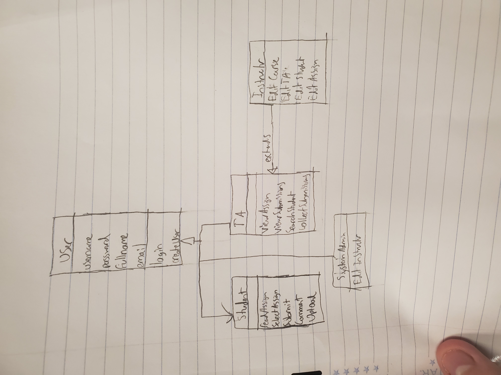
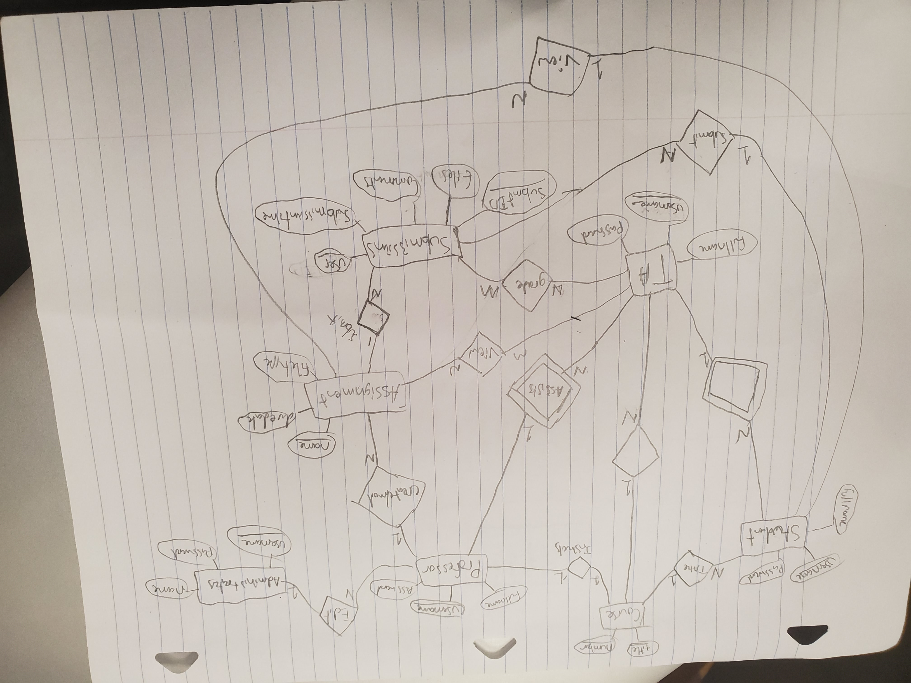

# CS4320 Thursday Week 4 Lab
## Group 13 - Design

Class Diagram Draft

(GitHub is rotating images 90 degrees - it is normal when downloaded)

ERD Diagram Draft

## Game Plan

Each of us do one Activity Diagram
Class Diagram - Matt Hudson (independent)
Use Case Diagram - Weiyu (independent)
ERD for the whole system - Samuel (independent)
Sequence Diagram for one activity - Matt & Samuel
State Machine Diagram - Samuel & Weiyu

Peer Reviewing
Matt - ERD, State Machine, Other 2 AD
Samuel - Use Case Diagram, Other 2 AD
Weiyu - Class Diagram, Sequence Diagram, Other 2 ADs
(Other 2 ADs == the ones each person didn't do)

Meet once no later than Tuesday Night
