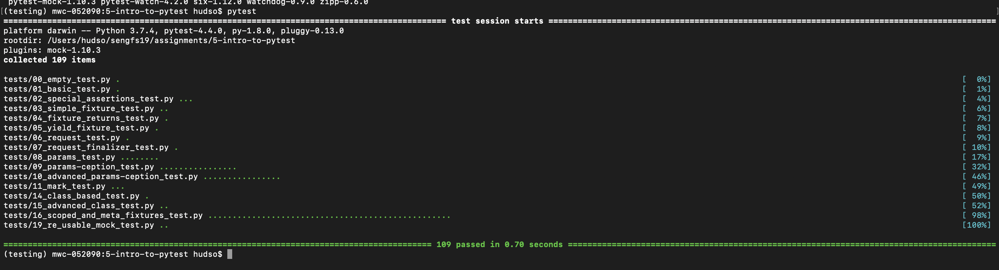

# Matt Hudson - Software Engineering Fall '19 - Thursday Week 5 Lab

*Using PyTest and understanding Unit Testing*

Overall, I had a very easy time following the tutorials. I've had previous Python 3 experience (though mostly just dabbling), and I've done work in unit/integration
testing frameworks in Java in my internship last summer (jUnit, hamcrest, etc.)

Setting up the virtual environment was very easy. I was able to run pytest successfully as well:

Running through the tutorials was equally easy to understand:

	- 00: Obviously it's just an empty test, that just runs `pass` and doesn't assert anything. But it demonstrates how pytest works: it runs each function that
	begins with `test`. It will only pass if it reaches a `pass` statement or it reaches the end of the function. Along the way, it can assert conditions to be true.

	- 01: This test adds an `assert` statement to check if two data sets are equal. If the condition is true, it will simply move on, in this case to the end of the function.
	If it's false, it will fail the test. The benefit of pytest is that it gives us information on why the test failed, so we as developers can identify the root of the problem.
	Also, assert can take two arguments: the condition to check, and what to print out if the assert fails. It's unnecessary when putting asserts in pytest test functions,
	but it's necessary for functions outside of pytest
	- 02: assert by itself only checks boolean conditions and the like. We can use special assertions to check other conditions, like if an exception is raised. Sometimes
	we want to test that an exception is raised, i.e. the function failed, to pass the test. For example, we `expect` a ZeroDivisionError in the first test. We use `with`
	to specify this assertion, then the code in this with block is run. This directive ensures the provided error is raised.
	Using `as` allows us to reference this information outside of the with-as block.
	Using pytest.approx allows us to make an assertion, but giving the system a little bit of leeway as to its definition of equality. So in this example, 0.1 + 0.2 =
	0.300000000000001 or something like that due to floating point math. So an equality assertion would fail here; we use approx to allow some room for error. Using this
	should be limited, however, since for example, you wouldn't want this error creeping up in a currency system.
	- 03: This tutorial is mostly review of what I covered before, but it points out that `assert`s in other, non-pytest functions should include a message to indicate
	what went wrong as the second argument. Pytest can only 'dig into' asserts in test functions.
	- 04: Fixtures are the same as `@before` and `@after` in jUnit, for example. It's code that gets run before and after tests to specify pre-post conditions for tests.
	For example, you might want to initialize some data before you run a test, and free any resources after the test. The big advantage of this model is that you can
	have multiple tests that use the same initial data, but by using fixtures, you only need to define the data *once*. This avoids boilerplate code. We use the
	`@pytest.fixture` annotation to specify that a function is a fixture. We can then use this fixture in a test function by including its name in the argument list.
	You can also define fixtures in other modules as global fixtures.
	- 05: You can use the `yield` statement at the end of fixtures to `yield` values to the tests calling the fixtures. So if you initialize some data, you need to yield
	it at the end of the fixture. `yield` is also used in python generators (functions that yield a series of values), but here we only yield once. You can include cleanup
	statements after the `yield`. In the test, the yielded data will be in a variable named the same as the fixture.

There's obviously more tutorials to read, but I already understand a lot about unit testing, so it's pretty easy to adapt these concepts to pytest.

I helped some people around me with running the initial configuration and basic python syntax.